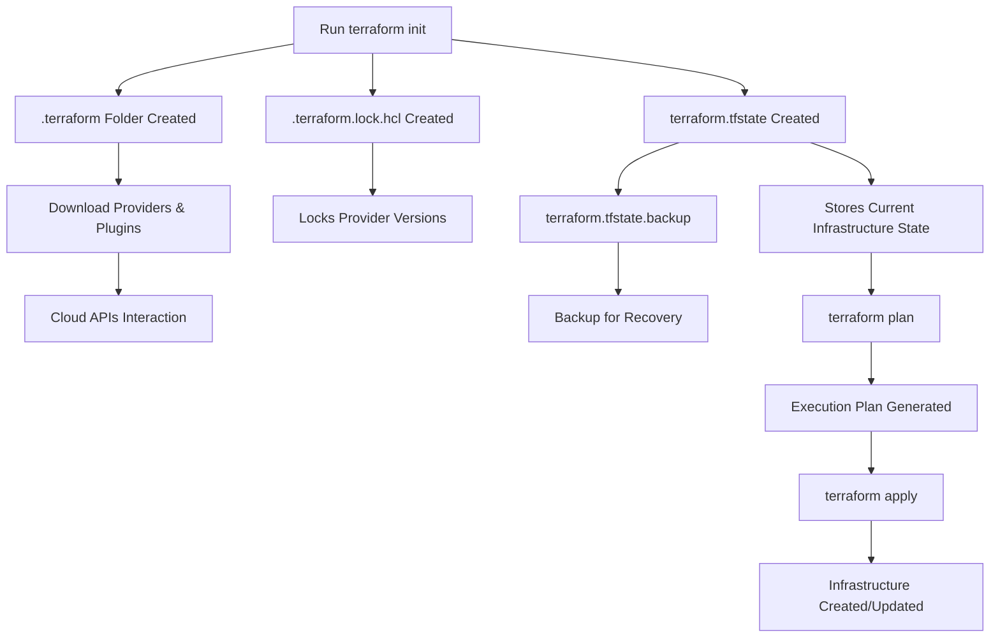

# Terraform-guide

What is Terraform?
-----------------------------------------------------------

* Terraform is an open-source Infrastructure as Code (IaC) tool developed by HashiCorp.
* It allows you to define, provision, and manage infrastructure (servers, databases, networking, etc.) using code — making infrastructure repeatable, consistent, and version-controlled.

⚙️ Infrastructure as Code (IaC)
-----------------------------------------------------------------------------------

Infrastructure as Code (IaC) is the practice of managing infrastructure (like servers, databases, and networks) through code rather than manual processes.

# 🚀 Terraform Internal Workflow Explained

Terraform is more than just a set of commands — it’s a powerful engine that translates your code into real cloud infrastructure.

This guide explains what happens behind the scenes in a simple, structured way.

---

## 🧭 Terraform Workflow Diagram

---

## 🔍 4 Critical Steps Every DevOps Engineer Should Know

### 📍 Step 1: Initialization (`terraform init`)

- Creates `.terraform/` directory  
- Downloads providers & plugins  
- Plugins are binary executables (`.exe` / `.bin`)  
- These interact directly with cloud APIs  

---

### 📍 Step 2: Locking Consistency (`.terraform.lock.hcl`)

- Ensures consistent provider versions  
- Prevents version mismatch across team  
- Avoids configuration drift  

---

### 📍 Step 3: State Management (`terraform.tfstate`)

Terraform acts as the **source of truth**.

- `terraform.tfstate` → Stores current infrastructure state  
- `terraform.tfstate.backup` → Backup for recovery  

---

### 📍 Step 4: Execution Phase (Plan & Apply)

- `terraform plan` → Shows what will change  
- `terraform apply` → Applies changes  

👉 Terraform Core works with providers to:
- Create resources  
- Update resources  
- Destroy resources  

---

## 💡 How It Works Internally

1. Terraform reads your `.tf` files  
2. Loads providers from `.terraform` folder  
3. Compares desired state vs current state (`tfstate`)  
4. Generates execution plan  
5. Applies changes via cloud APIs  

---

## 🔥 Real DevOps Insight

👉 Terraform does NOT directly create resources  
👉 Providers do the actual work  

Terraform = **Brain**  
Providers = **Hands**

---

## 🏷️ Tags
`Terraform` `DevOps` `Infrastructure as Code` `Cloud` `AWS` `GCP` and `Azure`